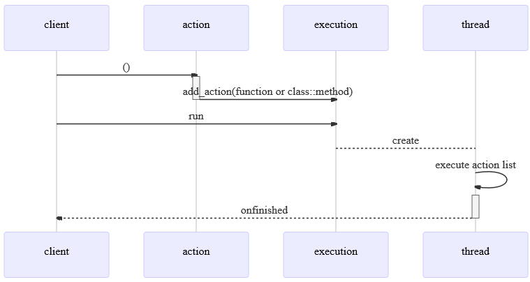
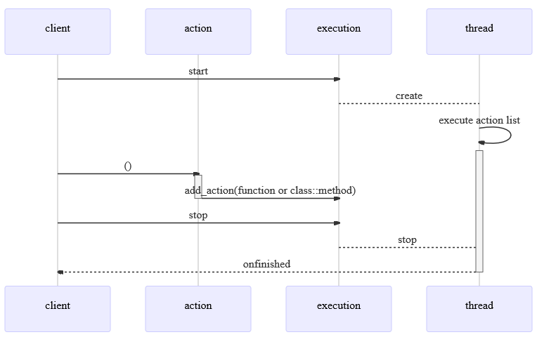

# async

*a mechanism to run queued callables in an asynchronous fashion*

The interface consists of one header file that expose a generic execution class. It is a wrapper of a list of callables that are invoked on other thread. The callables are pumped into the list by invoking an action from the caller thread.

There are provided two execution modes: one-off and continuous.

## one-off execution


### example: one-off execution of a plain function
```c++
#include <async.h>

void f()
{
  std::cout << "f thread " << std::this_thread::get_id() << std::endl;
}

int main()
{
  std::cout << "main thread " << std::this_thread::get_id() << std::endl;

  // declare an execution specialized for an action type
  untangle::async::execution<std::function<void(void)>> execution;
  std::function<void(void)> action;
  // create async binding between the action and f
  execution.bind_action_and_function(action, f);
  // whenever the action is invoked, a new callable wrapping f will be added to the execution's action list
  action();
  // run the execution
  execution.run();

  // add the execution object to the running poll
  untangle::async::execution_poll::get().add(execution);

  // wait the polled executions to finish
  while(untangle::async::execution_poll::get().isrunning())
  {
    std::this_thread::sleep_for(std::chrono::milliseconds(1));
  }

  return 0;
}
```

### example: one-off execution of a class method
```c++
#include <async.h>

class A
{
public:
  void f(int x)
  {
    std::cout << "A::f " << x << " thread " << std::this_thread::get_id() << std::endl;
  }
  std::function<void(int)> action;
};

int main()
{
  std::cout << "main thread " << std::this_thread::get_id() << std::endl;

  auto a = std::make_shared<A>();

  // declare an execution specialized for an action type
  untangle::async::execution<std::function<void(int)>> execution;
  execution.bind_action_and_method(a->action, a, &A::f); // note the bound object must be a shared pointer
  // whenever the action is invoked, a new callable wrapping f will be added to the execution's action list
  a->action(10);
  // run the execution
  execution.run();

  // add the execution object to the running poll
  untangle::async::execution_poll::get().add(execution);

  // wait the polled executions to finish
  while(untangle::async::execution_poll::get().isrunning())
  {
    std::this_thread::sleep_for(std::chrono::milliseconds(1));
  }

  return 0;
}
```

## continuous execution


### example: continuous execution of a plain function
```c++
#include <async.h>

void f()
{
  std::cout << "f thread " << std::this_thread::get_id() << std::endl;
}

int main()
{
  std::cout << "main thread " << std::this_thread::get_id() << std::endl;

  // declare an execution specialized for an action type
  untangle::async::execution<std::function<void(void)>> execution;
  std::function<void(void)> action;
  // create async binding between the action and f
  execution.bind_action_and_function(action, f);

  // run the execution
  execution.start();
  // add f to the execution's queue (three times)
  action();action();action();
  // stop the execution
  execution.stop();

  // add the execution object to the running poll
  untangle::async::execution_poll::get().add(execution);

  // wait the polled executions to finish
  while(untangle::async::execution_poll::get().isrunning())
  {
    std::this_thread::sleep_for(std::chrono::milliseconds(1));
  }

  return 0;
}
```

